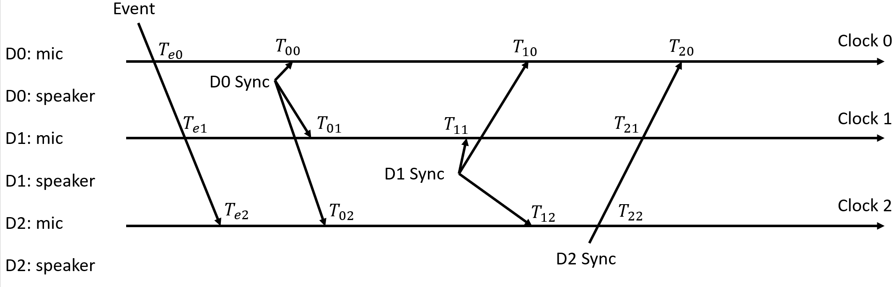

# Group Members:
Haochen Zhao and Tianyuan Nan

Haochen Zhao will be focusing on the hardware and protocol part. Tianyuan Nan will be focusing on the algorithm and github part. We will work together on the demo.

Key tasks:

* Haochen Zhao: audio capture routine
* Haochen Zhao: audio playback routine (for sync using sound)
* Haochen Zhao: acoutic event timestamping
* Haochen Zhao: protocol design
* Tianyuan Nan: time difference calculation and correction
* Tianyuan Nan: TDOA algorithm program and testing
* Tianyuan Nan: host server setup for data receiving
* Tianyuan Nan: github report and project website maintenance

# Table of Contents
* Abstract
* [Introduction](#1-introduction)
* [Related Work](#2-related-work)
* [Technical Approach](#3-technical-approach)
* [Evaluation and Results](#4-evaluation-and-results)
* [Discussion and Conclusions](#5-discussion-and-conclusions)
* [References](#6-references)

# Abstract

This project endeavors to transform any given surface into a functional touchscreen through the implementation of synchronized touch sensors. The primary objective involves the establishment of a system wherein three sensors are strategically positioned and synchronized to detect touch events sequentially, correlating with their respective distances from the event location. Utilizing the Time Difference of Arrival (TDOA) method, the project leverages the time variances between sensor pairs to compute the disparities in distances between sensors. This calculation aids in localizing the origin of the touch event by integrating the coordinates of the three sensors and their respective distance variances. The operational framework encompasses the programming of a server host capable of receiving post requests from the three sensors. Subsequently, the host computer executes TDOA functions to accurately estimate the location of the event source. This methodology promises to enable any surface to function as a touch-sensitive interface, expanding the possibilities for interactive user experiences across diverse environments.

After conducting the experiment, the firmware effectively transmits the necessary data to the server computer via a Wi-Fi network. This transmitted data is then utilized in calculating the time differences required for the Time Difference of Arrival (TDOA) functions. Consequently, these functions successfully incorporate this data as one of their inputs, culminating in the provision of a reasonable and accurate estimated location for the event source. The estimated location exhibits a standard deviation of up to 0.04 units from the actual location in both axes. This marginal deviation signifies the efficiency of the entire process.
# 1. Introduction

This section should cover the following items:

* Motivation & Objective: What are you trying to do and why? (plain English without jargon)
* State of the Art & Its Limitations: How is it done today, and what are the limits of current practice?
* Novelty & Rationale: What is new in your approach and why do you think it will be successful?
* Potential Impact: If the project is successful, what difference will it make, both technically and broadly?
* Challenges: What are the challenges and risks?
* Requirements for Success: What skills and resources are necessary to perform the project?
* Metrics of Success: What are metrics by which you would check for success?

### 1.a. Motivation & Objective

A flat surface can be more than just a surface. You can project onto it into a display. In this project we want to look at using everyday devices to turn a surface into touch sensor. More specifically, acoustic devices placed at the vertices pick up a touch event propagated through air and log the time of arrival. Using the time of arrival, we can solve the location of the touch event. This project involves two challenges, one is to solve the location of the touch location given time of arrival, the other is to make devices sync with each other to get accurate time of arrival. 

### 1.b. State of the Art & Its Limitations

For implementing touch interaction on large surface, several ways are avaible and some of them are already commercially viable. One way is to use a camera to track the touch event. However, it requires a camera to be placed above the surface and the camera needs to be calibrated. Also privacy can be harmed. Another way is to use a capacitive touch sensor. This is no different from any small touchscreen. But in the case of large surface, the cost and power consumption of the sensor can be high. Also, the sensor needs to be manufactured to adapt to the size. It is not plug and play. Another way is to use infrared pairs. By looking at which part has been blocked, we can infer the touch event. However, this method requires bulky hardware.

The idea of using acoustic to infer touch event is also popular and leads to some innovative work. In Acustico, the time difference between surface wave and sound wave are used to infer touch location. All equipments are on users's wrist. Since the time differnce is small, high sampling rate is necessary. Also, it provides relative location to hand instead of absolute location on the surface. 

In Toffee, microphoes at different edges of the same device are used and the TDoA is used to inference the relative angle of the touch event. It opens new way of user interaction. However, it does not provide localization on the surface.

In ALTo, the time difference of arrival of the event's acoustic signal at a bunch of microphones are used to infer touch location. The microphones are placed at the vertices of the surface. The microphones are connect to the same device for data collection and processing. We recognize this as very stringent as it does not scale to large surface. Also it prevent the possibility of using a bunch of independent devices to infer touch location. We consider this work as an important preliminary work and we want to extend it to a more practical case.

### 1.c. Novelty & Rationale

Our objective pertains to utilizing a collection of independent devices to deduce touch locations on a large surface. The intention is to formulate an inter-device protocol conducive to event localization. To facilitate this, we have established a server host capable of interfacing with three sensors via a Wi-Fi network, enabling data transmission and reception. Subsequently, a comprehensive Time-Difference of Arrival (TDOA) function has been meticulously developed. This function, given specific parameters and time disparities, empowers our program to reasonably estimate the spatial origin of the event.

### 1.d Potential Impact

We will have better understanding in time synchronization (Haochen's part) and localization (Tianyuan's part). Also this provides a new way to locate the acoustic source using independent sensors, as well as a more accurate way to solve for the TDOA hyperbolic equations.

### 1.5. Challenges

The audio kit we sourced uses MEMS microphone and small speaker. This may impair the ability to capture event and the ability to propagate information. If this is indeed an issue, we plan to make everything louder. Accurately determining the event source presents another significant challenge. A lack of precise time differences between sensors cause the program encountering considerable difficulty in solving the hyperbolic equation effectively. Addressing this challenge requires enhancements in both sensor capabilities and algorithmic methodologies. It becomes imperative to contemplate strategies for enhancing the clarity of event signal detection and devising a novel optimization function tailored to resolve the Time-Difference of Arrival (TDOA) equations more effectively.

### 1.e. Requirements for Success

Regarding hardware development, meticulous planning is imperative to enable consistent and stable sound capture, ensuring precise timestamping accuracy. This necessitates adeptness in real-time system development to achieve optimal results.

On the software front, meticulous attention must be given to designing a robust protocol facilitating seamless synchronization among devices. These interconnected devices must communicate flawlessly with a host server, devoid of any errors. Moreover, the implementation of an algorithm to estimate location is essential. The resulting estimated source location must align reasonably with the actual location, necessitating minimal deviation for optimal accuracy.

### 1.f. Metrics of Success

Our objective revolves around establishing a robust hardware infrastructure capable of efficiently delivering data to the host system. Subsequently, the host system must effectively relay this data to the Time-Difference of Arrival (TDOA) functions. These TDOA functions are then tasked with computing and furnishing an estimated location of the event source based on the received data.

# 2. Related Work
### 2.a. Papers

[Acustico: Surface Tap Detection and Localization using Wrist-based Acoustic TDOA Sensing](https://dl.acm.org/doi/10.1145/3379337.3415901) In Acustico, the time difference between surface wave and sound wave are used to infer touch location. All equipments are on users's wrist. Since the time differnce is small, high sampling rate is necessary. Also, it provides relative location to hand instead of absolute location on the surface. 

[ALTo: Ad Hoc High-Accuracy Touch Interaction Using Acoustic Localization](https://arxiv.org/abs/2108.06837) In Toffee, microphoes at different edges of the same device are used and the TDoA is used to inference the relative angle of the touch event. It opens new way of user interaction. However, it does not provide localization on the surface.

[Toffee: enabling ad hoc, around-device interaction with acoustic time-of-arrival correlation](https://dl.acm.org/doi/10.1145/2628363.2628383) In ALTo, the time difference of arrival of the event's acoustic signal at a bunch of microphones are used to infer touch location. The microphones are placed at the vertices of the surface. The microphones are connect to the same device for data collection and processing. We recognize this as very stringent as it does not scale to large surface. Also it prevent the possibility of using a bunch of independent devices to infer touch location. We consider this work as an important preliminary work and we want to extend it to a more practical case.

### 2.b. Software
[TDOA_DEMO] (https://github.com/dharmsen/tdoa-demo/tree/master) This python program provides a simple but effecient way to calculate the source location of a sound signal, derived with 3 microphones and multilateration. It solved the TODA functions using the fsolve function imported from scipy.optimize. 

# 3. Technical Approach
This project is based on two seperate components, the firmware and the software. We used three acoustic sensors as the firmware to receive the acoustic wave when an event occurs because three sensors is the minimum number to determine the specific location for it. We need the sensor that first receive the information as the reference sensors and synchronize other two sensors so that we can figure out the time difference. For the software side, we estimate the location based on the Time Difference of Arrival (TDOA) method. It requires at least two pairs of time difference, solving the hyperbolic functions to estimate the source location.  

### 3.a. Firmware

The firmware part is responsible to control the hardwares to listen to events and transmit syncronization signal when necessary. It is also responsible to maintain an internal clock to be able to tag the touch event and syncronization events. The information should be transmitted to the host computer through wifi.

The internal event clock is created with reference to the sampling process of the microphone. The microphone is sampling at 44.1kHz. The internal clock is created by counting the number of samples. The internal clock is used to tag the touch event and syncronization events. 

The touch event detection is done by comparing the sample with a threshold. If the sample is above the threshold, it is considered as a touch event. The threshold is determined by the noise level of the environment with some margin. The timestamp of the touch event is the timestamp of the sample with the maximum value.

After the touch event is detected, the device will send a syncronization signal to other devices. The syncronization signal is a short burst of sound. We use a sinc pulse with cutoff frequency of 8kHz. The timestamp of the syncronization signal is the timestamp of the sample with the maximum value. Each device has a different syncronization offset from the touch event. Every device is expected to receive its own sync event and sync sequences from other devices. In this way the time offsets between devices can be measured.

After all timestamps (1 event+ 3 syncronization) have been collected, the device will send the information to the host computer through wifi. The information includes the device id, the timestamp of the touch event, the three timestamps of the syncronization events. The data is serialized in json format. The string will be sent to the host using HTTP POST for further processing.

### 3.b. TDOA

This project employed the Time Difference of Arrival (TDoA) method for source localization. TDoA constitutes a technique utilized to ascertain the whereabouts of a sound source by measuring the time variance in the arrival of sound waves at distinct sensors. It involves the calculation of distance disparities via time delays, subsequently leveraging these differences alongside the spatial geometric positions of the sensors to precisely determine the location of the sound source.

Upon examining the provided image, it becomes evident that our Time Difference of Arrival (TDoA) calculation necessitates several constants. These constants encompass the coordinates of three sensors, in addition to the propagation speed. Furthermore, the process involves the reception of data from the firmware, which comprises three essential components: 'id,' defining the origin sensor transmitting the data; 'event_ts,' establishing the reference time for said sensor, crucial for synchronization and time difference calculation; and 'sync_ts,' delineating three distinct time instances, representing the moments of signal reception from all three sensors, including the sensor transmitting the data.

The collected data serves as the foundation for computing the time differences between each pair of sensors. Utilizing the known disparities in arrival times between two points, we can delineate the potential event locations through hyperbolic descriptions. To resolve these functions and estimate the event's location, I intend to employ scipy’s least-squares solver. Enhancing the solver's efficiency involves specifying the Jacobian matrix of this system, and this is just a collection of the partial derivatives of each function with respect to each independent variable. As a preliminary step before solving, an initial approximation for the event's location can be established by averaging the positions of the three observers. This approach mitigates issues related to undefined functions for specific points. Ultimately, the estimated location of the event will be obtained through this procedure.

### 3.c. Host
Given the spatial separation of three individual sensors, the implementation of a host server becomes pivotal to facilitate the transmission of data from each sensor through a post request, encapsulating the data as its payload. Consequently, upon the aggregation of all three sets of data, the server will proceed to store and apply it within the calculation process. To ensure a responsive and uncomplicated hosting mechanism, Python has been selected as the programming language of choice, utilizing the Flask library to construct the requisite components.

Under conditions where the sensors and the server computer coexist within the same Wi-Fi network, the server component becomes capable of receiving 'POST' method requests from the sensors. It proceeds to save the transmitted data, adhering to designated keys such as 'id,' 'event_ts,' and 'sync_ts.' Upon reaching the predetermined count constant 'real_received_length' of three, the server triggers the execution of functions responsible for computing delta_t and subsequently estimating the source location based on the collated data lists.

# 4. Evaluation and Results
The primary objective of this project is to demonstrate the attainment of precise estimations for the event source. This is accomplished through a series of sequential evaluation:
  * The error-free delivery of data by the firmware.
  * The successful reception of POST requests by the host and the accurate preservation of the corresponding payload.
  * The congruence between the calculated delta_t values and those manually derived through conventional methods.
  * The functionality of the Time Difference of Arrival (TDOA) functions in delivering a reasonable and plausible estimated coordinate for the event source.

The initial two evaluations indicate successful functionality of the firmware and effective communication between each sensor and the server. The transmitted payloads are appropriately and accurately stored within the server's database. An illustrative example involves setting the coordinates of the three sensors as [0,0], [-0.39, 0.26], and [-0.74, 0] respectively, while considering a propagation speed of 340 units. Furthermore, these sensors are programmed to sample at a frequency of 44100 Hz. The data received by the server is outlined below:

Accurate determination of delta_t holds paramount importance within the entirety of the estimation process. As previously mentioned, the Time Difference of Arrival (TDOA) methodology hinges upon precise time differences between each pair of sensors. These differences are significant in calculating distance disparities and subsequently resolving the system of hyperbolic equations. Therefore, an accurately derived delta_t list significantly enhances the precision of the ultimate TDOA estimation.

Moreover, we conduct manual calculations for delta_t to validate the integrity of our program, ensuring absence of errors or deviations. The resultant calculations are presented below:

| Program Calculation | Manually Calculation  |
| ------------------- | --------------------- |
| t01: -4.62682E-06   | t01: -4.62682E-06     |
| t02: 9.030279E-05   | t02: 9.03028E-05      |
| t12: 0.00051        | t12: 0.00051          |

The negative number for t01 means the sensor with id = 1 receiving the signal ealier than the sensor with id= 0. We can tell from above table that the program calculates perfect delta_t list. 

Lastly, we have to the check the program can provide an estimated coordinates standing for the event location. We also need to check the deviation between the estimated result and the actual location. After inputing the sensors' coordinates, propagation speed, and delta_t into the TDOA function, it builds up a hyperbolic system as well as the jacobian list. Within one second, it provides the estimated location for the source -- [-0.3310, -0.0164], and our event happened on the coordinate[-0.4, 0]. 

| axis | Source  | estimated Source | Standard Deviation  | Diff in Distance |
| ---- | ------- | ---------------- | ------------------- | ---------------- |
|  x   |  -0.4   |    -0.3310       |       0.0345        |      0.0690      | 
|  y   |    0    |    -0.0164       |       0.0082        |      0.0164      |

As previously outlined, our objective revolves around attaining a precise estimation for the event source location. Given that the observed differences in distance range between 0.01 to 0.07 units, and considering the spatial separation of our sensors, which ranges from 0.26 to 0.74 units, the estimated location derived can be deemed both reasonable and acceptable, but requiring more improvement to lower the deviation. The consistency between the calculated distances and the spatial layout of the sensors further validates the plausibility of the estimated location.

# 5. Discussion and Conclusions
The achieved results thus far are deemed acceptable but not yet perfect, indicating a necessity for comprehensive improvements in both firmware and software components.

Regarding the firmware, enhancing its precision in event detection stands as a crucial objective. Presently, our approach relies on a simplistic threshold mechanism to identify events, where any pulse surpassing this threshold is marked as an event occurrence. To augment accuracy, incorporating signal filtering mechanisms becomes imperative. Real-world scenarios introduce various sources of noise that may result in sensors providing inaccurate information. Enhancing the firmware with signal filters will mitigate such inaccuracies, thereby refining the initial step of the entire process and contributing to a more accurate program output.

On the software front, further refinement of both the server and TDOA functions is paramount. The current server implementation operates under the assumption of complete and sufficient data for analysis. However, it lacks the capability to handle incomplete or insufficient data, such as scenarios where a sensor transmits a sync_ts list containing fewer than three data points. Consequently, a crucial step involves data validation, ensuring the data's adequacy before applying it to TDOA estimations.

Additionally, while the estimated results show promise, a notable deviation from the actual location persists. Therefore, continued enhancements in the estimation process hold significance. These refinements aim to improve the estimation algorithm, thereby facilitating the derivation of more accurate and precise results.

In conclusion, this project offers a solution aimed at transforming any surface into a touchboard utilizing three independent acoustic sensors, leveraging the Time Difference of Arrival (TDOA) methodology. Through these sensors, the firmware successfully transmits requisite information via a Wi-Fi network to the server computer. The program adeptly computes accurate time differences and furnishes a reasonable estimated location for the event source.

This endeavor represents a significant step towards achieving synchronization among sensors while establishing a host server for seamless inter-device communication. Although the results obtained showcase notable progress, it's important to note that they are not flawless and warrant further enhancements to achieve heightened accuracy in estimation.

# 6. References
 
[1] Arvind Seshan.[ALTo: Ad Hoc High-Accuracy Touch Interaction Using Acoustic Localization] arXiv:2108.06837 (https://arxiv.org/abs/2108.06837)

[2] Jun Gong, Aakar Gupta, Hrvoje Benko.[Acustico: Surface Tap Detection and Localization using Wrist-based Acoustic TDOA Sensing] October 2020 (https://dl.acm.org/doi/10.1145/3379337.3415901)

[3] Peng Wu, Shaojing Su, Zhen Zuo, Xiaojun Guo, Bei Sun, Xudong Wen [Time Difference of Arrival (TDoA) Localization Combining Weighted Least Squares and Firefly Algorithm] June 2019 (https://www.mdpi.com/1424-8220/19/11/2554)

[4] Robert Xiao, Greg Lew, James Marsanico, Divya Hariharan, Scott Hudson, Chris Harrison.[Toffee: enabling ad hoc, around-device interaction with acoustic time-of-arrival correlation] September 2014 (https://dl.acm.org/doi/10.1145/2628363.2628383)

[5] Travis Mick.[A demonstration of TDOA multilateration] February 20, 2022 (https://lo.calho.st/posts/tdoa-multilateration/)

[6] Dalton Harmsen [tdoa-demo] (https://github.com/dharmsen/tdoa-demo/tree/master)

[7] Rubber Duck [TDoA Method for Sound Localization] April 2023 (https://codepal.ai/rubber-duck/query/hBGnS9QC/tdoa-method-for-sound-localization)

